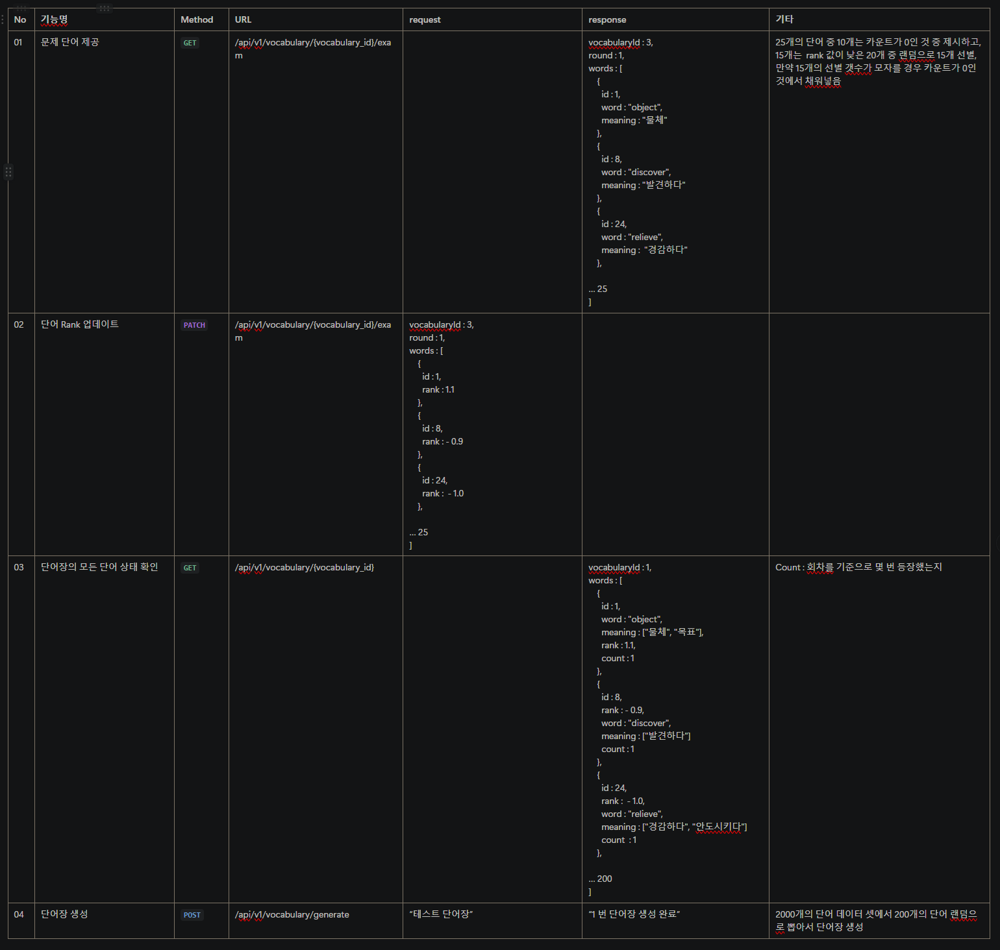

# DLNL 프로젝트 'Voca' 테스트 로직 검증

### 백엔드 단어 데이터 핸들링
#### 기본 아이디어
1. rank의 기본 값은 null로 주어진다.
2. 프론트엔드는 rank 계산법에 따라 출제된 단어의 rank를 계산해서 백엔드에게 넘겨준다.
3. 백엔드는 rank가 없는 단어 + rank의 값이 낮은 단어로 한 회차의 단어를 결정해서 문제를 준다.

#### 단어 제공 기준
1. [총 단어 수] / [단어장의 회차] 를 기준으로 신규 단어 갯수를 결정 (첫 번째 회차 고려하지 않음)
2. 각 회차에 주어지는 단어를 25개로 가정하고, 25개에서 1번 조건에서 산출한 값을 뺀 값은 rank가 결정된(다른 회차에서 출제된 적이 있던 단어) 단어로 채워넣음.
3. 이때 rank가 있는 단어는 낮은 순서대로 정렬하여 순차적으로 채워넣음

### 프론트엔드 단어 데이터 핸들링
#### 기본 아이디어 (25개의 문제(단어)를 백엔드가 제공하고 총 50개의 문제를 내야 한다고 가정)
1. 받은 단어의 id를 n배열에 넣는다.
2. 맞은 단어는 s배열로 옮겨넣는다.
3. 틀린 단어는 f배열에 옮겨넣는다.
4. f배열에 단어는 2번 더 등장시킨다.
5. 만약 f배열의 길이 x 2의 값이 25보다 작을 시 s배열에서 차이 만큼을 문제로 출제한다.
6. 만약 f배열의 길이 x 2의 값이 25보다 클 시 f 배열 중 일부는 2번, 일부는 1번 등장할 수 있다. (랜덤)
7. n배열에 존재하는 문제를 맞출 시 rank + 1, 틀릴 시 rank - 1 이다. (단어의 id로 PUT요청)
8. s나 f 배열에 존재하는 문제를 맞출 시 rank + 0.1, 틀릴 시 rank - 0.1 이다.
- 7, 8번의 경우 이전 회차에서 어땠는지는 고려하지 않는다. 이번 회차에서 n배열에 속했는지만 따짐
    - 예를 들어 1회차에서 처음 나왔을 때 틀리고, 나머지 두번 맞췄을 때 랭크 값은 0.8이 된다.
    - 나중에 3회차에서 같은 단어가 출제됐을 때, 처음 나왔을 때 맞춘다면, 1.8이 된다.
- rank 계산법
  - 한 회차에서 첫 번째로 출제시 맞추면 +1, 틀리면 -1이 됨
  - 한 회차에서 두 번째부터 출제시 맞추면 +0.1, 틀리면 -0.1이 됨
  - 프론트엔드가 계산 후 최종적으로 백엔드에게 발송

### API 명세
